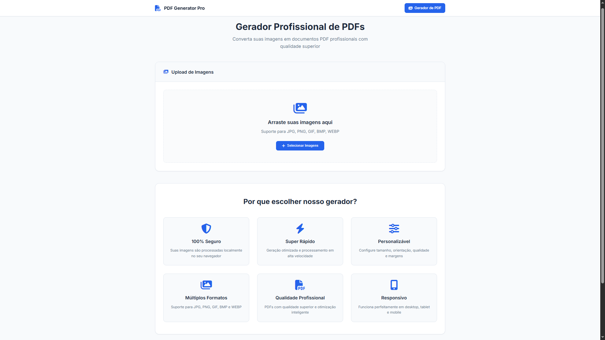
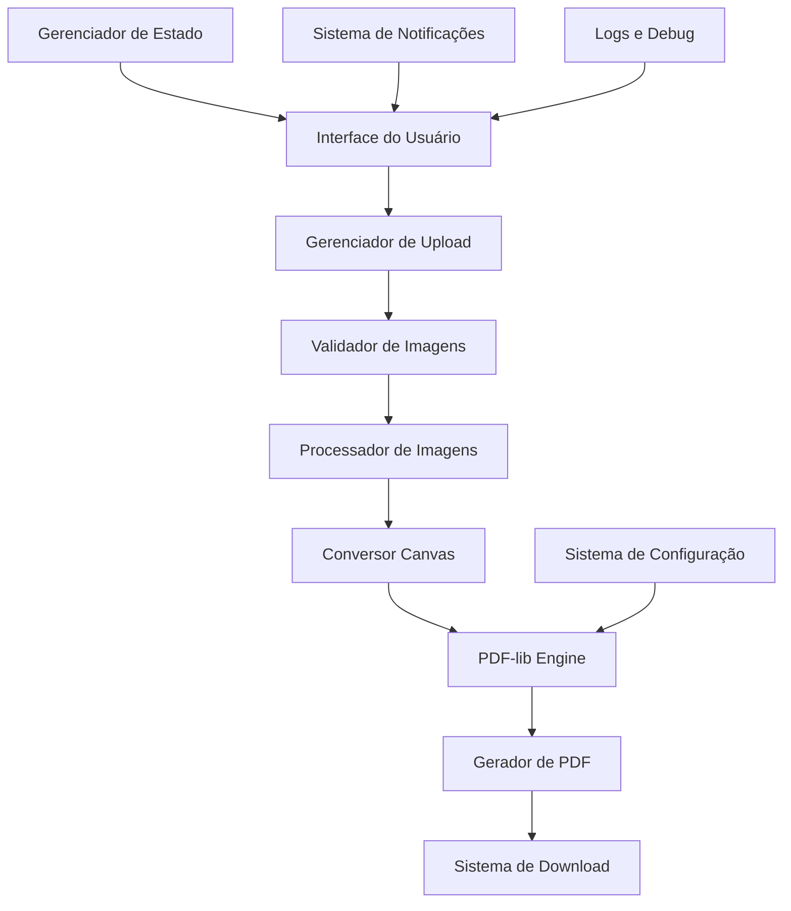
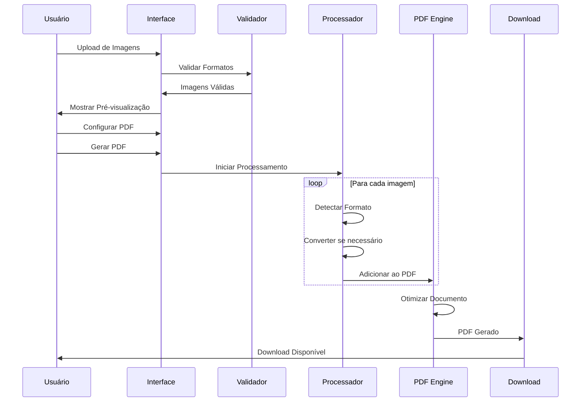

# 📄 PDF Generator Pro

[](https://vercel.com/new/clone?repository-url=https://github.com/projetosdavidsimer/gerador-de-pdfs)
[](https://opensource.org/licenses/MIT)
[](https://github.com/projetosdavidsimer/gerador-de-pdfs/stargazers)
[](https://github.com/projetosdavidsimer/gerador-de-pdfs)

> **Transforme suas imagens em documentos PDF profissionais com qualidade superior!**

Uma aplicação web moderna e profissional que converte múltiplas imagens em documentos PDF de alta qualidade, com cada imagem em uma página separada. Interface elegante estilo SaaS, processamento 100% local e compatibilidade universal com formatos de imagem.

## 🌟 Características Principais

- **🖼️ Conversão Universal**: Suporte completo para JPG, PNG, GIF, BMP, WEBP
- **📑 Uma Imagem por Página**: Cada imagem é colocada em uma página separada
- **🔒 100% Seguro**: Processamento local no navegador - suas imagens nunca saem do seu computador
- **⚡ Super Rápido**: Conversão otimizada com feedback em tempo real
- **🎨 Interface SaaS**: Design profissional e moderno
- **📱 Totalmente Responsivo**: Funciona perfeitamente em todos os dispositivos
- **⚙️ Altamente Configurável**: Controle total sobre formato, orientação, qualidade e margens

## 🚀 Demo Online

**[🔗 Acesse a aplicação online](https://gerador-de-pdfs.vercel.app/)**

### 📸 Captura de Tela do Aplicativo



*Interface moderna e profissional do PDF Generator Pro - Transforme suas imagens em documentos PDF com qualidade superior*

## ✨ Funcionalidades Detalhadas

### 📤 Upload Inteligente de Imagens
- **Drag & Drop**: Arraste múltiplas imagens diretamente para a interface
- **Seleção Manual**: Clique para selecionar arquivos do seu computador
- **Pré-visualização**: Veja todas as imagens antes da conversão
- **Validação Automática**: Detecção inteligente de formatos de imagem
- **Contador Dinâmico**: Acompanhe quantas imagens foram selecionadas

### 🎛️ Configurações Avançadas do PDF
- **Tamanhos de Página**: A4, Letter, Legal, A3
- **Orientação**: Retrato ou Paisagem
- **Qualidade da Imagem**: Alta, Média ou Baixa
- **Margens Personalizáveis**: De 0 a 50mm
- **Nome do Arquivo**: Defina o nome do PDF gerado
- **Ordenação**: Por ordem original, nome, tamanho ou data

### 📊 Processamento em Tempo Real
- **Barra de Progresso**: Acompanhe o progresso da conversão
- **Status Detalhado**: Veja qual imagem está sendo processada
- **Logs Completos**: Sistema de debug avançado no console
- **Tratamento de Erros**: Continua processando mesmo se uma imagem falhar
- **Notificações Elegantes**: Feedback visual para todas as ações

### 💾 Resultados Profissionais
- **Estatísticas Completas**: Número de páginas, tamanho final, configurações usadas
- **Download Direto**: Baixe o PDF gerado instantaneamente
- **Qualidade Garantida**: Imagens centralizadas e otimizadas em cada página
- **Compatibilidade Universal**: PDFs que funcionam em qualquer dispositivo

## 🏗️ Arquitetura do Sistema

### 📋 Visão Geral da Arquitetura



### 🔧 Componentes Principais

#### 1. **Frontend (Interface do Usuário)**
```
├── 🎨 Interface SaaS Moderna
│   ├── Navigation Bar
│   ├── Upload Zone (Drag & Drop)
│   ├── Configuration Panel
│   ├── Image Preview Grid
│   ├── Progress Indicators
│   └── Results Dashboard
```

#### 2. **Core Engine (Processamento)**
```
├── ⚙️ Image Processing Engine
│   ├── Format Detection
│   ├── Canvas Converter
│   ├── Quality Optimizer
│   └── Error Handler
│
├── 📄 PDF Generation Engine
│   ├── PDF-lib Integration
│   ├── Page Layout Manager
│   ├── Image Positioning
│   └── Document Optimizer
```

#### 3. **State Management (Gerenciamento de Estado)**
```
├── 🗂️ Application State
│   ├── Selected Images Array
│   ├── Configuration Object
│   ├── Processing Status
│   └── Generated PDF Blob
```

### 🔄 Fluxo de Processamento



## 🛠️ Stack Tecnológico

### **Frontend**
- **HTML5**: Estrutura semântica moderna
- **CSS3**: Design system com variáveis CSS, Grid e Flexbox
- **JavaScript ES6+**: Programação assíncrona e modular
- **Font Awesome 6.4.0**: Ícones profissionais
- **Google Fonts (Inter)**: Tipografia corporativa

### **Bibliotecas Principais**
- **PDF-lib 1.17.1**: Engine de geração de PDF
- **Canvas API**: Conversão e processamento de imagens
- **File API**: Manipulação de arquivos no navegador
- **Drag & Drop API**: Interface intuitiva de upload

### **Ferramentas de Desenvolvimento**
- **Git**: Controle de versão
- **GitHub**: Repositório e colaboração
- **Vercel**: Deploy e hospedagem
- **VS Code**: Ambiente de desenvolvimento

### **Arquitetura de Deploy**
```
┌─────────────────┐    ┌──────────────────┐    ┌──────────��──────┐
│   GitHub Repo   │───▶│   Vercel Build   │───▶│  CDN Global     │
│                 │    │                  │    │                 │
│ - Source Code   │    │ - Static Build   │    │ - Edge Caching  │
│ - Version Control│    │ - Optimization   │    │ - Fast Delivery │
└─────────────────┘    └──────────────────┘    └─────────────────┘
```

## 🚀 Instalação e Execução

### **Pré-requisitos**
- Navegador moderno (Chrome 80+, Firefox 75+, Safari 13+, Edge 80+)
- Servidor HTTP local (para desenvolvimento)

### **Instalação Local**

1. **Clone o repositório**
   ```bash
   git clone https://github.com/projetosdavidsimer/gerador-de-pdfs.git
   cd gerador-de-pdfs
   ```

2. **Execute localmente**
   
   **Opção 1: Python Server**
   ```bash
   python -m http.server 8000
   # Acesse: http://localhost:8000
   ```
   
   **Opção 2: Node.js Server**
   ```bash
   npx http-server -p 8000 -c-1
   # Acesse: http://localhost:8000
   ```
   
   **Opção 3: PHP Server**
   ```bash
   php -S localhost:8000
   # Acesse: http://localhost:8000
   ```

3. **Desenvolvimento com Live Reload**
   ```bash
   # Usando Live Server (VS Code Extension)
   # Ou usando browser-sync
   npx browser-sync start --server --files "*.html,*.css,*.js"
   ```

### **Deploy Automático**

[](https://vercel.com/new/clone?repository-url=https://github.com/projetosdavidsimer/gerador-de-pdfs)

### **Deploy Manual no Vercel**

```bash
# Instalar Vercel CLI
npm i -g vercel

# Login
vercel login

# Deploy
vercel

# Deploy para produção
vercel --prod
```

## 📁 Estrutura do Projeto

```
gerador-de-pdfs/
├── 📄 index.html              # Interface principal
├── 🎨 styles.css              # Sistema de design CSS
├── ⚡ script.js               # Engine de processamento
├── 📦 package.json            # Metadados do projeto
├── ⚙️ vercel.json             # Configuração de deploy
├── 🔒 .gitignore              # Arquivos ignorados
├── 📖 README.md               # Documentação
└── 📂 assets/                 # Recursos estáticos
    ├── 🖼️ images/             # Imagens do projeto
    └── 📄 docs/               # Documentação adicional
```

### **Detalhamento dos Arquivos Principais**

#### `index.html` - Interface do Usuário
```html
<!-- Estrutura modular e semântica -->
├── Navigation Bar
├── Content Header
├── Upload Section
├── Configuration Panel
├── Image Preview Grid
├── Processing Interface
├── Results Dashboard
└── Features Section
```

#### `styles.css` - Sistema de Design
```css
/* Arquitetura CSS moderna */
├── CSS Variables (Design Tokens)
├── Reset e Base Styles
├── Component Styles
├── Layout System (Grid/Flexbox)
├── Responsive Design
├── Animations e Transitions
└── Utility Classes
```

#### `script.js` - Engine de Processamento
```javascript
// Arquitetura modular
├── State Management
├── Event Handlers
├── Image Processing
├── PDF Generation
├── UI Controllers
├── Utility Functions
└── Error Handling
```

## 🎯 Como Usar

### **Passo a Passo Detalhado**

1. **📤 Upload de Imagens**
   - Arraste imagens para a zona de upload
   - Ou clique em "Selecionar Imagens"
   - Formatos aceitos: JPG, PNG, GIF, BMP, WEBP

2. **⚙️ Configuração do PDF**
   - **Tamanho da Página**: Escolha entre A4, Letter, Legal, A3
   - **Orientação**: Retrato (vertical) ou Paisagem (horizontal)
   - **Qualidade**: Alta, Média ou Baixa
   - **Margens**: Defina em milímetros (0-50mm)
   - **Nome do Arquivo**: Personalize o nome do PDF
   - **Ordem das Imagens**: Original, por nome, tamanho ou data

3. **🖼️ Pré-visualização**
   - Veja todas as imagens selecionadas
   - Ordem das páginas no PDF
   - Remova imagens individuais se necessário

4. **🚀 Geração do PDF**
   - Clique em "Gerar PDF"
   - Acompanhe o progresso em tempo real
   - Veja qual imagem está sendo processada

5. **📊 Resultados**
   - Estatísticas completas do PDF gerado
   - Informações sobre páginas, tamanho e configurações
   - Download direto do arquivo

6. **💾 Download**
   - Clique em "Download PDF"
   - Arquivo salvo com o nome personalizado
   - Pronto para uso em qualquer aplicação

## 🔒 Segurança e Privacidade

### **Processamento 100% Local**
- ✅ **Sem Upload**: Nenhuma imagem é enviada para servidores
- ✅ **Sem Armazenamento**: Nada é salvo em servidores externos
- ✅ **Sem Tracking**: Não coletamos dados pessoais
- ✅ **Open Source**: Código totalmente auditável

### **Tecnologias de Segurança**
- **Client-Side Processing**: Todo processamento no navegador
- **Memory Management**: Limpeza automática de recursos
- **Error Isolation**: Falhas isoladas por imagem
- **HTTPS Only**: Comunicação segura (em produção)

## 🎨 Design System

### **Paleta de Cores**
```css
:root {
  --primary-color: #2563eb;      /* Azul principal */
  --success-color: #059669;      /* Verde sucesso */
  --warning-color: #d97706;      /* Laranja aviso */
  --danger-color: #dc2626;       /* Vermelho erro */
  --background-color: #f8fafc;   /* Fundo claro */
  --surface-color: #ffffff;      /* Superfície */
  --text-primary: #1e293b;       /* Texto principal */
  --text-secondary: #64748b;     /* Texto secundário */
}
```

### **Tipografia**
- **Fonte Principal**: Inter (Google Fonts)
- **Pesos**: 300, 400, 500, 600, 700
- **Escala**: 12px, 14px, 16px, 18px, 20px, 24px, 28px, 32px, 36px

### **Componentes**
- **Cards**: Containers com sombra sutil
- **Buttons**: Estados hover e active
- **Forms**: Inputs com validação visual
- **Notifications**: Sistema de feedback
- **Progress**: Barras de progresso animadas

## 📊 Performance e Otimização

### **Métricas de Performance**
- ⚡ **Carregamento**: < 2 segundos
- 🖼️ **Processamento**: ~1 segundo por imagem
- 💾 **Memória**: Otimizada para múltiplas imagens
- 📱 **Mobile**: 100% responsivo

### **Otimizações Implementadas**
- **Lazy Loading**: Carregamento sob demanda
- **Memory Cleanup**: Limpeza automática de recursos
- **Canvas Optimization**: Processamento eficiente
- **Progressive Enhancement**: Funciona sem JavaScript

## 🤝 Contribuindo

### **Como Contribuir**

1. **Fork** o projeto
2. **Crie** uma branch (`git checkout -b feature/nova-funcionalidade`)
3. **Commit** suas mudanças (`git commit -m 'Adiciona nova funcionalidade'`)
4. **Push** para a branch (`git push origin feature/nova-funcionalidade`)
5. **Abra** um Pull Request

### **Diretrizes de Contribuição**

- **Código Limpo**: Siga as convenções estabelecidas
- **Testes**: Teste em múltiplos navegadores
- **Documentação**: Atualize a documentação se necessário
- **Performance**: Mantenha a performance otimizada

### **Reportando Issues**

Use o template de issue no GitHub:
- **Descrição clara** do problema
- **Passos para reproduzir**
- **Screenshots** (se aplicável)
- **Informações do ambiente** (navegador, OS)

## 📈 Roadmap

### **Versão 2.1** (Próxima)
- [ ] 🌍 Internacionalização (i18n)
- [ ] 🎨 Temas personalizáveis
- [ ] 📋 Templates de página
- [ ] 🔄 Processamento em lote otimizado

### **Versão 2.2** (Futuro)
- [ ] 📱 PWA (Progressive Web App)
- [ ] ☁️ Integração com cloud storage
- [ ] 🔗 API para desenvolvedores
- [ ] 📊 Analytics de uso

### **Versão 3.0** (Longo Prazo)
- [ ] 🤖 IA para otimização automática
- [ ] 📝 OCR e extração de texto
- [ ] 🎥 Suporte a vídeos
- [ ] 🔐 Assinatura digital

## 📞 Suporte e Comunidade

### **Canais de Suporte**
- 🐛 **Issues**: [GitHub Issues](https://github.com/projetosdavidsimer/gerador-de-pdfs/issues)
- 💬 **Discussões**: [GitHub Discussions](https://github.com/projetosdavidsimer/gerador-de-pdfs/discussions)
- 📧 **Email**: contato@davidsimer.dev

### **Comunidade**
- ⭐ **GitHub Stars**: Mostre seu apoio
- 🍴 **Forks**: Contribua com melhorias
- 📢 **Compartilhe**: Ajude outros desenvolvedores

## 📄 Licença

Este projeto está licenciado sob a **Licença MIT** - veja o arquivo [LICENSE](LICENSE) para detalhes.

### **Resumo da Licença**
- ✅ Uso comercial permitido
- ✅ Modificação permitida
- ✅ Distribuição permitida
- ✅ Uso privado permitido
- ❗ Sem garantia
- ❗ Sem responsabilidade

## 👨‍💻 Autor

**David Simer**
- 🌐 **Website**: [davidsimer.dev](https://davidsimer.dev)
- 💼 **LinkedIn**: [David Simer](https://linkedin.com/in/david-simer)
- 🐙 **GitHub**: [@projetosdavidsimer](https://github.com/projetosdavidsimer)
- 📧 **Email**: contato@davidsimer.dev

## 🙏 Agradecimentos

### **Tecnologias e Bibliotecas**
- [PDF-lib](https://pdf-lib.js.org/) - Engine de manipulação de PDF
- [Font Awesome](https://fontawesome.com/) - Ícones profissionais
- [Google Fonts](https://fonts.google.com/) - Tipografia Inter
- [Vercel](https://vercel.com/) - Plataforma de deploy

### **Inspirações**
- Comunidade open source
- Feedback dos usuários
- Melhores práticas de UX/UI
- Padrões de design moderno

---

<div align="center">

### **⭐ Se este projeto foi útil, considere dar uma estrela!**

[](https://github.com/projetosdavidsimer/gerador-de-pdfs/stargazers)

**Transforme suas imagens em PDFs profissionais hoje mesmo!**

[🚀 **Experimente Agora**](https://gerador-de-pdfs.vercel.app) | [📖 **Documentação**](https://github.com/projetosdavidsimer/gerador-de-pdfs) | [🤝 **Contribua**](https://github.com/projetosdavidsimer/gerador-de-pdfs/blob/main/CONTRIBUTING.md)

</div>